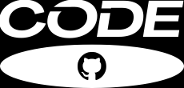

# 💿 DVD-nostalgic-animation

[](https://opensource.org)

A C++ Raylib project dedicated to honoring the classic DVD screensaver from the 1990s to the 2000s. This project combines high-performance native code with a custom visual identity inspired by vintage optical media layouts.

<p align="center">
  
</p>

## 🎨 Visual Identity

The project features a unique visual identity created in Canva:
* **Typography:** Uses the bold, geometric, futuristic lines of the **Horizon** typeface.
* **The Twist:** Features a custom stylized adaptation instead of a generic standard layout.

---

## 🚀 Features

* 📺 **Native Raylib Rendering:** Uses the lightweight Raylib hardware-accelerated graphics library.
* 📐 **Mathematical Precision:** Tracks boundary collisions smoothly for highly satisfying corner hits.
* 🎨 **Dynamic Color Shifting:** The custom logo dynamically changes color themes upon every wall collision.

---

## 🛠️ Installation & Compilation

### Prerequisites

To compile and run this project, you must have a C++ compiler (`g++`) and the **Raylib development library** configured on your platform.

* **macOS:** Install via Homebrew: `brew install raylib`
* **Linux (Ubuntu/Debian):** Install via APT: `sudo apt install libraylib-dev`
* **Windows (Detailed Setup Below):** Requires setting up the MinGW compiler toolchain and Raylib library dependencies.

---

### 🪟 Detailed Windows Environment Setup

If you are on Windows, follow these clear steps to install the compiler, set up Raylib, and configure your system variables.

#### Step 1: Install the C++ Compiler via MSYS2
1. Download and run the installer from the official site: [msys2.org](https://msys2.org)
2. Open the **MSYS2 UCRT64** terminal window that launches after installation.
3. Install the standard C++ compilation toolchain by typing this command and hitting Enter:
   ```bash
   pacman -S minw-w64-ucrt-x86_64-gcc
   ```

#### Step 2: Install Raylib via MSYS2
In the same open MSYS2 UCRT64 terminal window, install the pre-compiled Raylib package by running:
```bash
pacman -S mingw-w64-ucrt-x86_64-raylib
```

#### Step 3: Add the Compiler to your Windows PATH Variable
Windows needs to know where your new `g++` compiler lives so you can run it from any terminal window.
1. Press the **Windows Key**, type `env`, and select **Edit the system environment variables**.
2. Click the **Environment Variables...** button at the bottom right.
3. Under the *System variables* list (bottom section), find and click on the variable named **Path**, then click **Edit...**.
4. Click **New** on the right side, and paste the exact installation path for your compiler binaries:
   ```text
   C:\msys64\ucrt64\bin
   ```
5. Click **OK** on all open dialog windows to save your configuration.
6. **Restart your terminal** or code editor to apply the system variable updates.

---

### 🚀 Setup & Build Instructions

1. **Clone the repository** to your local machine:
   ```bash
   git clone https://github.com
   ```

2. **Navigate** into the project directory:
   ```bash
   cd DVD-nostalgic-animation
   ```

3. **Compile the source code** using the appropriate Raylib linking flags for your operating system:

   * **Windows (MinGW/UCRT terminal):**
     ```bash
     g++ main.cpp -o screensaver.exe -lraylib -lopengl32 -lgdi32 -lwinmm
     ```
   * **Linux:**
     ```bash
     g++ main.cpp -o screensaver -lraylib -lGL -lm -lpthread -ldl -lrt -lX11
     ```
   * **macOS:**
     ```bash
     g++ main.cpp -o screensaver -lraylib -framework OpenGL -framework Cocoa -framework IOKit -framework CoreVideo
     ```

4. **Run the executable:**
   * **Windows:**
     ```bash
     screensaver.exe
     ```
   * **Mac / Linux:**
     ```bash
     ./screensaver
     ```

---

## 📜 License & Disclaimers

This project's custom source code is licensed under the **MIT License**—feel free to fork, modify, and build upon it. 

### ⚖️ Trademark Notice
The visual layout of this software is a creative, non-commercial fan project developed solely for nostalgic, educational, and hobby purposes. The customized assets draw inspiration from historical consumer electronics logos; however, this repository is **not** associated with, certified by, or endorsed by the *DVD Format/Logo Licensing Corporation (DVD FLLC)* or any official hardware manufacturers.
